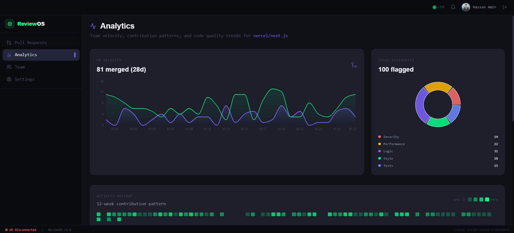
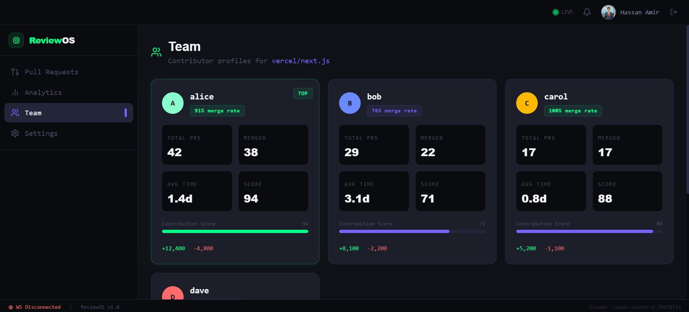
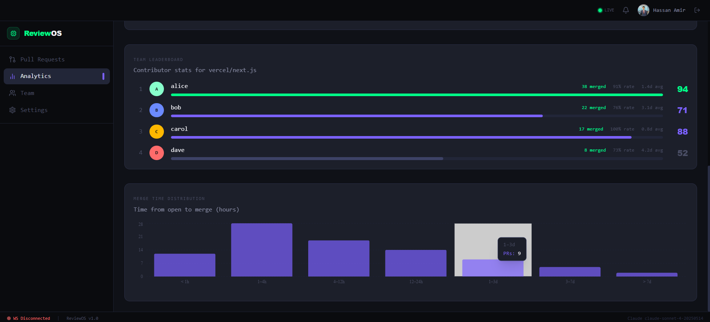
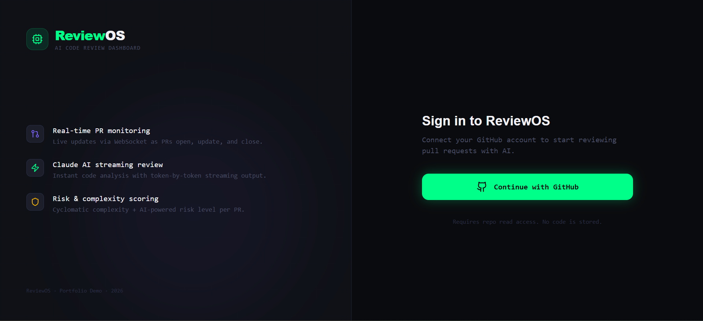

# ReviewOS — AI Code Review Dashboard

> Production-grade, AI-powered GitHub Pull Request review platform with real-time streaming reviews, analytics, and collaborative developer tooling.


---

# Live Demo

👉 [https://reviewosapp.vercel.app](https://reviewosapp.vercel.app)

---

# Preview

<!-- Add your screenshots below -->

## Dashboard




## AI Review Panel




## Analytics




## Login Screen



---

# Why I Built ReviewOS

I wanted to build a production-grade AI developer platform that combines:

* real-time systems
* GitHub integrations
* streaming AI responses
* modern frontend architecture
* scalable backend infrastructure
* developer-focused UX

The goal was to simulate a real SaaS engineering environment rather than creating a simple tutorial project.

ReviewOS focuses heavily on performance, developer experience, and production-level architecture.

---

# Features

| Feature                     | Description                                                                    |
| --------------------------- | ------------------------------------------------------------------------------ |
| 🤖 **AI Code Review**       | Claude Sonnet 4 streams reviews token-by-token via WebSocket                   |
| 📊 **Analytics Dashboard**  | Velocity charts, contribution heatmaps, merge histograms, and team leaderboard |
| 🔄 **Real-time Updates**    | New PRs appear instantly through WebSocket push events                         |
| 📁 **Advanced Diff Viewer** | Syntax-highlighted unified diffs with file tree navigation                     |
| 🔐 **GitHub OAuth**         | Secure authentication using NextAuth v5 + GitHub OAuth                         |
| 🪝 **Webhook Processing**   | GitHub webhook ingestion with HMAC signature verification                      |
| ⌨️ **Keyboard Navigation**  | Vim-style navigation using J/K shortcuts                                       |
| 🧠 **Complexity Analysis**  | Cyclomatic complexity scoring for multiple languages                           |
| ⚡ **Streaming Reviews**     | AI responses stream live token-by-token                                        |
| 📡 **Background Workers**   | Celery-powered async task processing                                           |

---

# Tech Stack

## Frontend

* **Next.js 14** (App Router + Server Components)
* **TypeScript** strict mode
* **Tailwind CSS** with custom design system
* **Framer Motion** animations
* **Recharts + D3** visualizations
* **Zustand** state management
* **TanStack Query** data fetching
* **NextAuth v5** authentication

## Backend

* **FastAPI** async API framework
* **Anthropic SDK** for Claude streaming
* **SQLAlchemy** async ORM
* **PostgreSQL** database
* **Redis** caching & pub/sub
* **Celery** background workers
* **httpx** async GitHub API integration

## DevOps & Deployment

* **Vercel** frontend hosting
* **Docker Compose** local orchestration
* **GitHub OAuth Apps** authentication
* **WebSockets** real-time communication

---

# Architecture

```text
GitHub Webhooks
        │
        ▼
    FastAPI Backend
        │
 ┌──────┴──────┐
 ▼             ▼
Redis       PostgreSQL
 │
 ▼
WebSocket Broadcast
 │
 ▼
Next.js Frontend
```

---

# Project Structure

```text
reviewos/
├── frontend/                 # Next.js 14 frontend
│   ├── app/                  # App Router pages
│   ├── components/           # UI + feature components
│   ├── hooks/                # Data hooks
│   ├── lib/                  # API + websocket clients
│   ├── store/                # Zustand state stores
│   └── types/                # TypeScript types
│
├── backend/                  # FastAPI backend
│   ├── app/
│   │   ├── routers/          # REST + WebSocket routes
│   │   ├── services/         # AI, GitHub, Analytics
│   │   ├── models/           # SQLAlchemy models
│   │   ├── schemas/          # Pydantic schemas
│   │   ├── tasks/            # Celery workers
│   │   └── utils/            # Parsers & helpers
│   │
│   └── alembic/              # Database migrations
│
└── docker-compose.yml
```

---

# Quick Start

## 1. Clone Repository

```bash
git clone https://github.com/YOUR_USERNAME/reviewos.git
cd reviewos
```

---

## 2. Configure Environment Variables

```bash
cp .env.example .env
```

Fill in all required values.

---

## 3. Create GitHub OAuth App

1. Go to [https://github.com/settings/developers](https://github.com/settings/developers)
2. Create a new OAuth App
3. Set callback URL:

```bash
http://localhost:3000/api/auth/callback/github
```

4. Copy credentials into `.env`

```env
GITHUB_ID=your_client_id
GITHUB_SECRET=your_client_secret
```

---

## 4. Run with Docker Compose

```bash
docker-compose up --build
```

Services:

| Service     | URL                                                      |
| ----------- | -------------------------------------------------------- |
| Frontend    | [http://localhost:3000](http://localhost:3000)           |
| Backend API | [http://localhost:8000](http://localhost:8000)           |
| API Docs    | [http://localhost:8000/docs](http://localhost:8000/docs) |
| PostgreSQL  | localhost:5432                                           |
| Redis       | localhost:6379                                           |

---

## 5. Run Database Migrations

```bash
docker-compose exec backend alembic upgrade head
```

---

# Development Without Docker

## Backend

```bash
cd backend
python -m venv .venv
source .venv/bin/activate
pip install -r requirements.txt
uvicorn app.main:app --reload --port 8000
```

## Frontend

```bash
cd frontend
npm install
npm run dev
```

---

# Environment Variables

Critical environment variables:

| Variable                   | Description                  |
| -------------------------- | ---------------------------- |
| `ANTHROPIC_API_KEY`        | Claude API key               |
| `GITHUB_TOKEN`             | GitHub personal access token |
| `GITHUB_ID`                | GitHub OAuth client ID       |
| `GITHUB_SECRET`            | GitHub OAuth secret          |
| `NEXTAUTH_SECRET`          | Session signing secret       |
| `NEXTAUTH_URL`             | Frontend deployment URL      |
| `NEXT_PUBLIC_DEFAULT_REPO` | Default repository           |

Generate a secure NextAuth secret:

```bash
openssl rand -base64 32
```

---

# WebSocket Protocol

```json
{ "type": "pr.opened", "data": { ... } }
{ "type": "pr.updated", "data": { ... } }
{ "type": "pr.closed", "data": { ... } }
{ "type": "review.token", "data": { ... } }
{ "type": "review.complete", "data": { ... } }
{ "type": "review.error", "data": { ... } }
{ "type": "sync.status", "data": { ... } }
```

---

# Keyboard Shortcuts

| Key | Action                |
| --- | --------------------- |
| `J` | Next Pull Request     |
| `K` | Previous Pull Request |
| `R` | Trigger AI Review     |

---

# Deployment

| Platform     | Purpose             |
| ------------ | ------------------- |
| Vercel       | Frontend hosting    |
| PostgreSQL   | Persistent database |
| Redis        | Cache + pub/sub     |
| GitHub OAuth | Authentication      |

---

# Future Improvements

* Multi-repository support
* Team collaboration comments
* Inline AI suggestions
* CI/CD integrations
* AI-generated summaries
* Slack / Discord notifications
* Repository health scoring

---

# License

MIT License

Built as a portfolio project focused on real-world software engineering practices.

